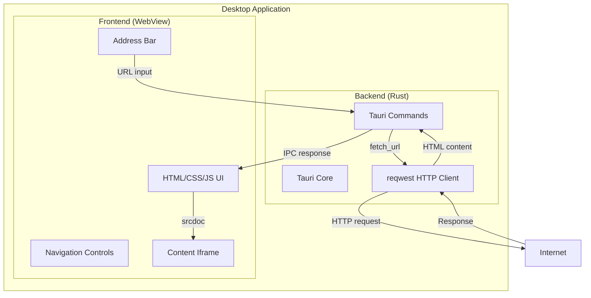
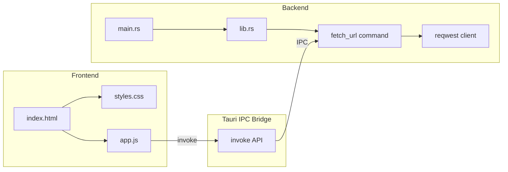
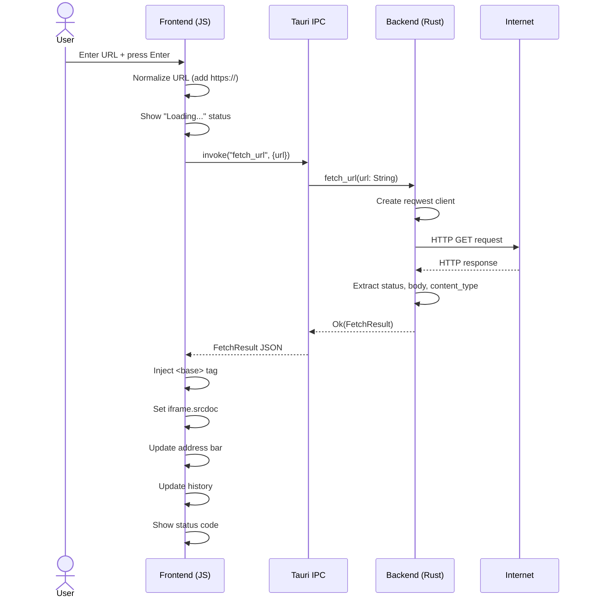
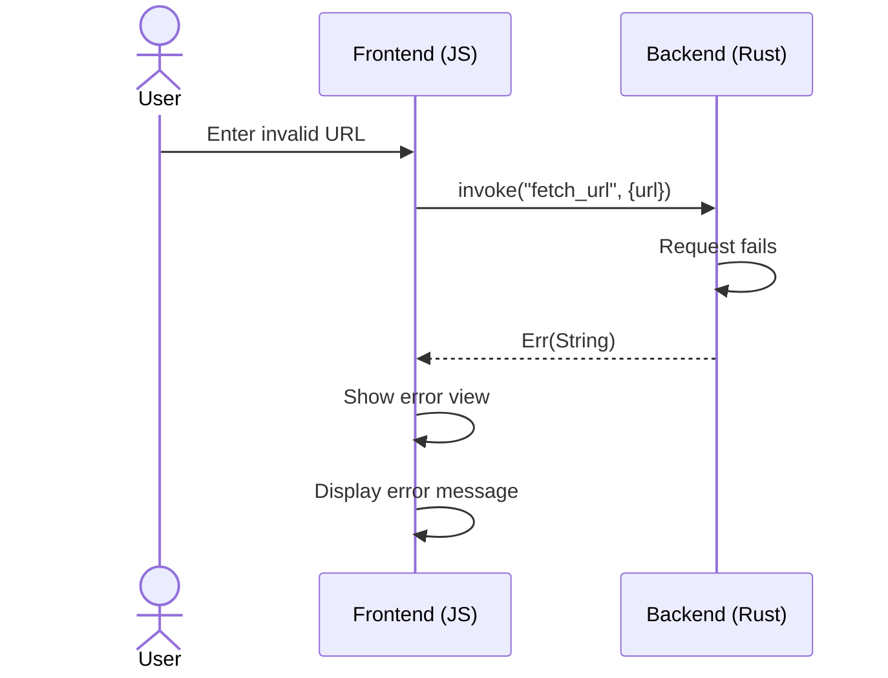

# Architecture Design Document (ADD)

## Web Navigator

**Version**: 0.1.0
**Last Updated**: 2026-03-01

---

## 1. System Architecture

Web Navigator follows the standard Tauri 2 architecture: a Rust backend process managing the native window and system resources, with an HTML/CSS/JS frontend rendered in a webview.

### 1.1 High-Level Architecture



### 1.2 Component Diagram



## 2. Data Flow

### 2.1 Page Navigation Flow



### 2.2 Error Flow



## 3. Technology Stack Rationale

| Layer | Technology | Rationale |
|-------|-----------|-----------|
| Backend | Rust + Tauri 2 | Native performance, small binary, cross-platform, memory safety |
| Frontend | HTML5/CSS/JS | No build step needed, lightweight, universal browser compatibility |
| HTTP Client | reqwest | Industry-standard Rust HTTP client, async support, redirect handling |
| IPC | Tauri Commands | Type-safe, secure IPC between frontend and backend |
| Build | Tauri Bundler | Native packaging for all platforms (.deb, .rpm, .msi, .dmg) |

## 4. Module Breakdown

### 4.1 Backend Modules

| Module | File | Responsibility |
|--------|------|---------------|
| Entry Point | `main.rs` | Application bootstrap, calls `lib::run()` |
| Core Library | `lib.rs` | Tauri builder setup, command registration |
| fetch_url | `lib.rs` | HTTP fetching via reqwest, URL normalization, response packaging |

### 4.2 Frontend Modules

| Module | File | Responsibility |
|--------|------|---------------|
| Layout | `index.html` | Page structure: toolbar, status bar, content area |
| Styling | `styles.css` | Dark theme, responsive layout, animations |
| Logic | `app.js` | Navigation, IPC calls, history management, DOM updates |

### 4.3 Key Data Structures

```rust
// Response from backend to frontend
struct FetchResult {
    status: u16,        // HTTP status code
    body: String,       // Response body (HTML)
    content_type: String, // MIME type
    final_url: String,  // URL after redirects
}
```

## 5. Security Considerations

- Content is rendered inside an iframe with `sandbox="allow-same-origin allow-scripts allow-forms"`.
- HTTP requests go through the Rust backend, not directly from the webview.
- The reqwest client enforces a 30-second timeout and 10-redirect limit.
- Tauri's CSP is set to `null` to allow rendering fetched content.
